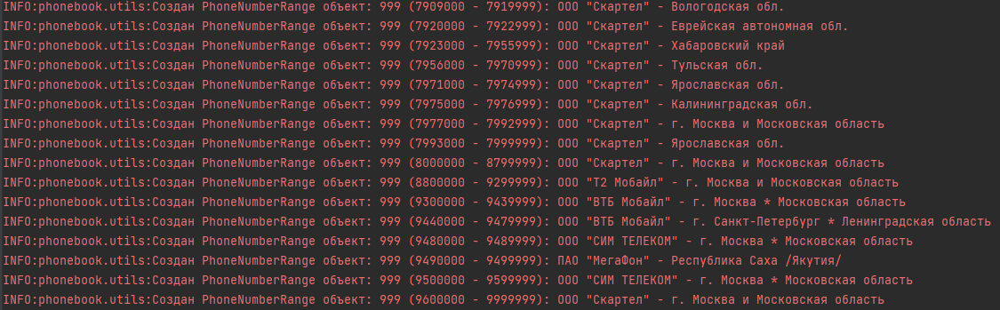

### Инструкция по проекту

Реализована система, которая определяет по номеру телефона оператора связи и регион. Состоит из АПИ, веб-интерфейса 
и утилиты по загрузке необходимых данных в БД.

Для работы проекта потребуются:

- Python3
- Postgresql
- Django
- DRF
- Celery

1. Клонировать проект:
   ```
   git clone https://github.com/EchoFoe/atrax_tz.git
   ```

2. Создайте виртуальное окружение в корне проекта и установите зависимости
   ```
   python -m venv venv && source venv/bin/activate && pip install -r requirements.txt
   ```
3. Создайте БД (postgres), создайте файл `.env` (использует python-dotenv) в корне проекта и укажите свои конфиги
    ```
   DB_NAME=ur_db_name
   DB_USER=ur_db_user
   DB_PASSWORD=ur_db_pass
   DB_HOST=localhost
   DB_PORT=5432
   ```
4. Создайте суперпользователя:
   ```
   python manage.py createsuperuser 
   ```
5. Произведите миграции (миграции уже приложены) и запустите сервер бэкенда:
    ```
    poetry run python manage.py migrate
    poetry run python manage.py runserver 
    ```
6. Наполните БД данными. Для этого нужно из консоли корня проекта вызвать выполнение функции следующим образом:
    ```
    from phonebook.utils import load_csv_data_to_database
    load_csv_data_to_database() 
    ```
Дождитесь выполнения выгрузки   
7. Если все хорошо, то должны увидеть в логах что-то типа этого

8. Затем зайдите в админку по url: http://127.0.0.1:8000/admin/phonebook/phonenumberrange/ и должны увидеть таблицы.
9. Когда БД готова, тестируем API по url: http://127.0.0.1:8000/api/phone-number-info/
10. Также тестируем Веб-форму по url: http://127.0.0.1:8000/